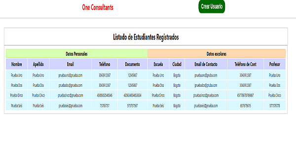
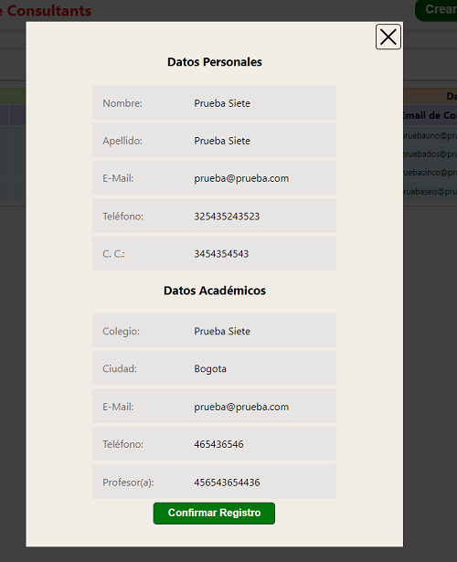

# OneConsultants

> Se trata de una miniaplicación creada en la parte de Backend con Nestjs conectado una base de datos de MongoDB, y en la parte del Frontend con Reactjs, implementando Redux para conservar el estado de la aplicación.

> Para probar la aplicación en local abrir una terminal en la raíz del proyecto ./OneConsultants; con el comando **npm install** se instalan las dependencias necesarias.

Para poner en marcha los dos servicios tanto de Frontd, como el de Back es necesario abrir dos terminales en la misma ubicación (la raíz del proyecto).

> En una terminal correr el comando **npm run server** el cual pondrá en marcha el servidor.
> En la otra terminal correr el comando **npm run app** el cual pondrá en marcha el Frontd de la aplicación y abrirá el navegador predeterminado del pc en la url [http://localhost:3000/](http://localhost:3000/ "http://localhost:3000/").

    

_Ya estando en el navegador se podrán ver una tabla los datos almacenados en la base de datos. En la parte superior (en el Header) hay un botón para poder crear un nuevo registro._

> Al dar clic en dicho botón se abre una ventana modal solicitando los datos personales del usuario a registrar.

    

> Se deben ingresar la totalidad de los datos. Al llenar estos, aparece un botón dando la posibilidad de continuar.

    

> El cual dirige a otro formulario donde se solicitan los datos del centro educativo del usuario.

    

> Al llenar estos vuelve a aparecer el botón de continuar que esta ves dirige a una ventana donde se listan los datos ingresados para ser verificados, y en la parte inferior hay un botón para confirmar el registro del nuevo usuario.

    

 
 > Al dar confirmar se cierra la ventana y ese nuevo registro se listara en la tabla antes mencionada.
